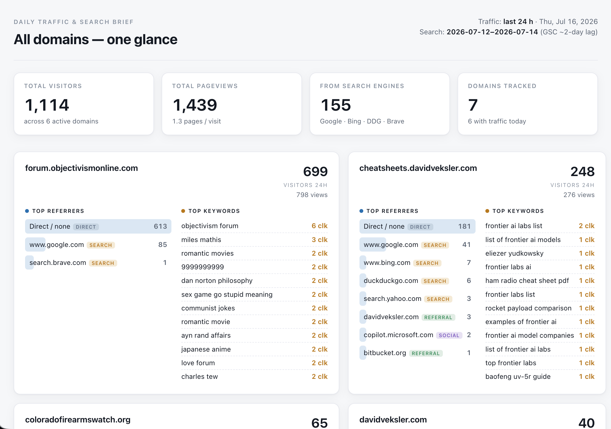

# stats-dashboard

Daily traffic + search dashboard for all my domains, at **https://stats.davidveksler.com**.



- **Traffic + referrers** (24 h, 7 d, or 30 d) — Cloudflare Web Analytics (RUM) via the GraphQL Analytics API, with previous-period comparisons and anomaly callouts.
- **Search performance + queries + landing pages** — aggregate Google Search Console clicks, impressions, CTR, and average position, plus ranked query and page detail. GSC data lags ~2 days, so cards show the freshest full 3-day window.
- **Traffic source mix** — direct, search, social, referral, and unlisted sessions for the selected traffic period.
- A **Cron Trigger** pulls both every night at **13:00 UTC (~6 am Pacific)**, writes one snapshot per domain into **D1**, and sends an **ntfy** push (topic `david-stats-cf-serp`).
- The dashboard renders from stored D1 snapshots, so it loads instantly and builds **14-day sparklines** over time. Domain filters, traffic/change sorting, mobile disclosure, and light/dark themes are built in.

## Architecture

```
Cron 13:00 UTC ─┐
                ├─> Worker (src/index.js runDaily)
 /run?key=…  ───┘        ├─ pullTraffic()  → Cloudflare GraphQL (all 4 accounts)
                         ├─ querySearchSummary()/queryKeywords()/queryPages() → Google Search Console
                         ├─ write snapshot → D1 (traffic, referrers, queries, pages)
                         └─ sendNtfy()     → ntfy.sh/david-stats-cf-serp

GET /            → loadDashboard() reads D1 → renderDashboard() HTML
GET /api/json    → same data as JSON (`period`, `domain`, and `sort` query params)
GET /health      → "ok"
GET /run?key=…   → manual re-pull (needs REFRESH_KEY secret)
```

Files: `src/config.js` (domains + accounts), `src/cloudflare.js` (RUM pull),
`src/gsc.js` (Search Console + JWT auth), `src/render.js` (HTML), `src/index.js` (handlers).

## Domains tracked

Edit `SITES` in `src/config.js`. `host` = the Cloudflare Web Analytics requestHost;
`gsc` = the exact Search Console property string (`sc-domain:…` or a URL prefix).
Set `gscPageFilter` to an RE2 expression when a broad property needs to be limited to
specific page URLs. The `davidveksler.com` card uses this to exclude subdomains.

## Google Search Console auth (done — kept for reference)

The nightly job runs headless, so it can't use an interactive Google login. It uses a
**service account** (`GSC_SA_KEY`, now set). If `GSC_SA_KEY` is ever missing, traffic/referrers
still work fully and keywords are simply skipped (the ntfy push notes it). To rotate the key,
repeat these steps and run `./deploy.sh --gsc-key path/to/key.json`.

1. Google Cloud Console → create (or pick) a project → **APIs & Services → Enable APIs** →
   enable **Google Search Console API**.
2. **IAM & Admin → Service Accounts → Create service account**. No roles needed.
3. On the new account → **Keys → Add key → JSON**. Download the key file.
4. In **Search Console** (https://search.google.com/search-console), for **each** property
   → Settings → **Users and permissions → Add user** → paste the service account's
   `client_email` (looks like `name@project.iam.gserviceaccount.com`) → **Restricted** (read) is enough.
   Do this for every configured property.
5. Store the whole JSON key as the Worker secret (one line):
   ```sh
   export CLOUDFLARE_API_TOKEN=<your-cf-token>
   wrangler secret put GSC_SA_KEY < path/to/key.json
   ```
6. Trigger a pull to confirm keywords populate:
   ```sh
   curl "https://stats.davidveksler.com/run?key=$REFRESH_KEY"
   # gscOk should be true; the ntfy warning disappears
   ```

## Deploy / operate

Use the deploy script — idempotent, parses the CF token from `~/Projects/.cloudflare.env`,
ensures secrets, deploys, and smoke-tests:

```sh
./deploy.sh                     # install, ensure secrets, deploy, verify /health
./deploy.sh --refresh           # ...then trigger a live pull (/run) and print the result
./deploy.sh --gsc-key key.json  # also (re)set the GSC service-account secret
./deploy.sh --schema            # also (re)apply schema.sql — needs a D1:Edit-scoped token
```

From Windows PowerShell, use the Git Bash wrapper. It avoids accidentally selecting WSL's
older Node runtime and forwards the same options:

```powershell
.\deploy.ps1
.\deploy.ps1 -Refresh
.\deploy.ps1 -Schema
.\deploy.ps1 -GscKey C:\path\to\key.json
```

Manual bits:
```sh
export CLOUDFLARE_API_TOKEN=<first token in ~/Projects/.cloudflare.env>
npm run deploy    # raw wrangler deploy
npm run tail      # live logs
```

Secrets (set once via `wrangler secret put`, or auto-provisioned by `deploy.sh`):
- `CF_API_TOKEN` — Cloudflare token with **Account Analytics: Read** (the Worker's GraphQL calls). ✅ set
- `REFRESH_KEY` — protects `GET /run`. ✅ set (saved locally in `.deploy/refresh_key.txt`, gitignored)
- `GSC_SA_KEY` — Google service-account JSON. ✅ set

> Note: the analytics token deploys the Worker and binds D1 at runtime, but is **not** scoped
> for D1 management writes, so `d1 execute --remote` / `--schema` can fail with codes `10000`
> or `7500`. Additive dashboard migrations are also applied idempotently through the Worker's
> runtime D1 binding before a data pull.

Vars (in `wrangler.jsonc`): `NTFY_TOPIC = david-stats-cf-serp`.

## Resources (created 2026-07-16)

- Worker: `stats-dashboard` on account **David Veksler's Websites** (`556c237bf8cb62edb8f7b401499bb7a9`)
- D1: `stats-dashboard` (`2f5ea431-472e-462f-94a4-b396576c1a5b`)
- Custom domain: `stats.davidveksler.com`
- Cron: `0 13 * * *`

## Notes / limitations

- **Sessions are not unique people** — Cloudflare's free RUM tier doesn't expose uniques.
  Referrer ranks use sessions; internal navigation is excluded.
- The `davidveksler.com` GSC property is a broad `sc-domain:` property, but its dashboard query
  filters the page dimension to root-domain URLs. This keeps its keywords separate from
  `cheatsheets.davidveksler.com` without requiring another GSC property.
- D1 grows ~a few KB/day; no pruning needed for years. Add a retention `DELETE` if desired.
